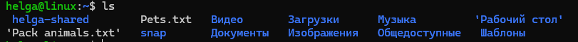
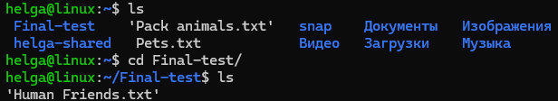
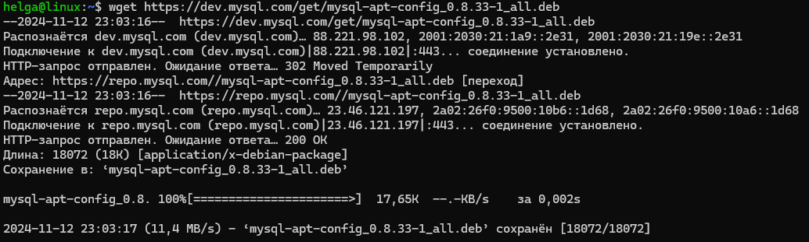
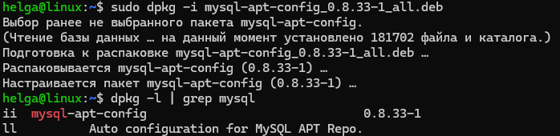
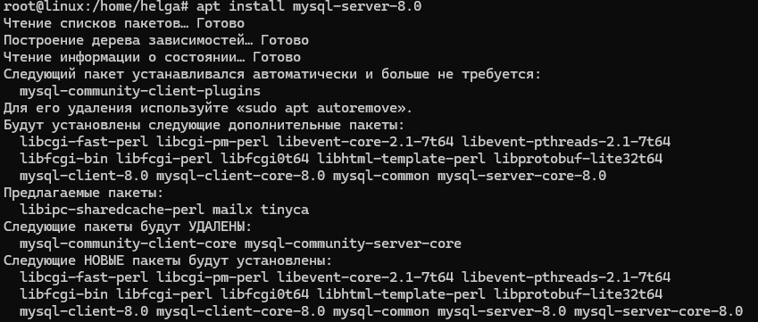
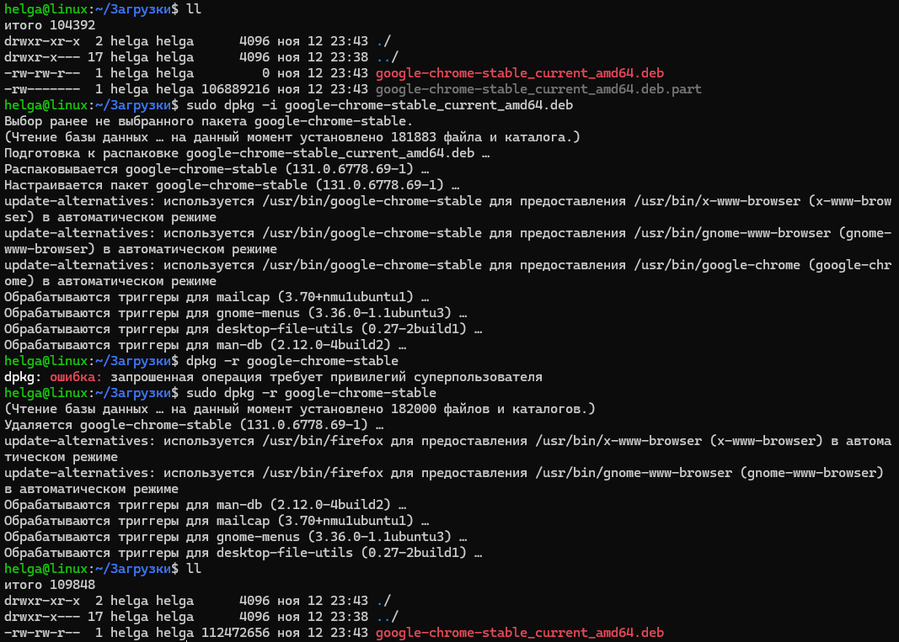

### Операционные системы и виртуализация (Linux)

1. **Использование команды `cat` в Linux**

- Создать два текстовых файла: "Pets" (Домашние животные) и "Pack animals" (Вьючные животные), используя команду `cat` в терминале Linux. В первом файле перечислить собак, кошек и хомяков. Во втором — лошадей, верблюдов и ослов.

```
~$ cat > Pets.txt
собака
кошка
хомяк
волнистый попугай
кролик
канарейка

~$ cat > 'Pack animals.txt'
лошадь
верблюд
осел
олень
коза
лама
```

   


- Объединить содержимое этих двух файлов в один и просмотреть его содержимое.

```
~$ cat Pets.txt 'Pack animals.txt' > Animals.txt
~$ cat Animals.txt
собака
кошка
хомяк
волнистый попугай
кролик
канарейка
лошадь
верблюд
осел
олень
коза
лама
```

- Переименовать получившийся файл в "Human Friends".
Пример конечного вывода после команды `ls` :
`Desktop Documents Downloads  HumanFriends.txt  Music  PackAnimals.txt  Pets.txt  Pictures  Videos`

```
~$ mv Animals.txt 'Human Friends.txt'
```


2. **Работа с директориями в Linux**

- Создать новую директорию и переместить туда файл "Human Friends".

```
~$ mkdir Final-test
~$ mv "Human Friends.txt" Final-test/
```




3. **Работа с MySQL в Linux. Установить MySQL на вашу вычислительную машину.**

- Подключить дополнительный репозиторий MySQL
```
~# wget https://dev.mysql.com/get/mysql-apt-config_0.8.33-1_all.deb
```



- Установить один из пакетов из этого репозитория
  
```
~# dpkg -i mysql-apt-config_0.8.33-1_all.deb
# apt update
# apt install mysql-server-8.0

root@linux:/home/helga# ps afx | grep mysql  
  16607 ?        Ssl    0:04 /usr/sbin/mysqld

root@linux:/home/helga# ss -ntlp
  LISTEN      0      151    127.0.0.1:3306        0.0.0.0:*
    users:(("mysqld",pid=16607,fd=23))

root@linux:/home/helga# mysql
  Welcome to the MySQL monitor.  Commands end with ; or \g.
  Your MySQL connection id is 8
  Server version: 8.0.40-0ubuntu0.24.04.1 (Ubuntu)

  Copyright (c) 2000, 2024, Oracle and/or its affiliates.

mysql>
```





4. **Управление deb-пакетами**

- Установить и затем удалить deb-пакет, используя команду `dpkg`

```
$ sudo dpkg -i google-chrome-stable_current_amd64.deb
$ sudo dpkg --purge google-chrome-stable
```



5. **История команд в терминале Ubuntu**

- Сохранить и выложить историю ваших терминальных команд в Ubuntu.
В формате: Файла с ФИО, датой сдачи, номером группы (или потока)

```
history
  50  cat > Pets.txt
  51  cat > 'Pack animals.txt'
  52  ll
  53  ls
  54  cat Pets.txt 'Pack animals.txt' > Animals.txt
  55  cat Animals.txt
  56  mv Animals.txt 'Human Friends.txt'
  57  ls
  58  mkdir Final-test
  59  mv "Human Friends.txt" Final-test/
  60  ls
  61  cd Final-test/
  62  ls
  ...
  68  wget https://dev.mysql.com/get/mysql-apt-config_0.8.33-1_all.deb
  ...
  95  sudo dpkg -i mysql-apt-config_0.8.33-1_all.deb
  96  dpkg -l | grep mysql
  ...

  root@linux:/home/helga# history    
    9  apt install mysql-server-8.0
   10  ps afx
   11  ps afx | grep mysql
   12  ss -ntlp
   13  mysql
   14  history  
  ```
