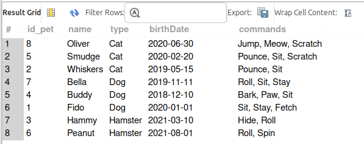

### Объектно-ориентированное программирование

7. **Работа с MySQL. Задача выполняется в случае успешного выполнения задачи “Работа с MySQL в Linux. “Установить MySQL на вашу машину”**

    7.1. После создания диаграммы классов в 6 пункте, в 7 пункте база данных "Human Friends" должна быть структурирована в соответствии с этой диаграммой. Например, можно создать таблицы, которые будут соответствовать классам "Pets" и "Pack animals", и в этих таблицах будут поля, которые характеризуют каждый тип животных (например, имена, даты рождения, выполняемые команды и т.д.).

    7.2. В ранее подключенном MySQL создать базу данных с названием "Human Friends".
   - Создать таблицы, соответствующие иерархии из вашей диаграммы классов.
   - Заполнить таблицы данными о животных, их командах и датами рождения.
   - Удалить записи о верблюдах и объединить таблицы лошадей и ослов.
   - Создать новую таблицу для животных в возрасте от 1 до 3 лет и вычислить их возраст с точностью до месяца.
   - Объединить все созданные таблицы в одну, сохраняя информацию о принадлежности к исходным таблицам.

```
DROP SCHEMA IF EXISTS Human_Friends;
CREATE SCHEMA Human_Friends;

USE Human_Friends;

/*
***********************************************************************
Создать таблицы, соответствующие иерархии из вашей диаграммы классов.
***********************************************************************
*/
-- Связанные таблицы для типа животных "Pets"

DROP TABLE IF EXISTS Type_Pets;
CREATE TABLE Type_Pets(
    id_type_pet INT PRIMARY KEY AUTO_INCREMENT NOT NULL,
    type_name VARCHAR(45)
);

DROP TABLE IF EXISTS Commands_Pets;
CREATE TABLE Commands_Pets(
    id_command_pet INT PRIMARY KEY AUTO_INCREMENT NOT NULL,
    command_name VARCHAR(45)
);

DROP TABLE IF EXISTS Pets;
CREATE TABLE Pets(
    id_pet INT PRIMARY KEY AUTO_INCREMENT NOT NULL,
    pet_name VARCHAR(45),
    id_type_pet INT NOT NULL,
    birthDate DATE NOT NULL,
    FOREIGN KEY (id_type_pet) REFERENCES Type_Pets(id_type_pet)
);

DROP TABLE IF EXISTS PetsAndCommands;
CREATE TABLE PetsAndCommands(
    id_pet INT NOT NULL,
    id_command_pet INT NOT NULL,
    PRIMARY KEY (id_pet, id_command_pet)
    -- FOREIGN KEY (id_pet) REFERENCES Pets(id_pet),
    -- FOREIGN KEY (id_command_pet) REFERENCES Commands_Pets(id_command_pet)
);


-- Связанные таблицы для типа животных "Pack_Animals"

DROP TABLE IF EXISTS Type_Pack;
CREATE TABLE Type_Pack(
    id_type_pack INT PRIMARY KEY AUTO_INCREMENT NOT NULL,
    type_name VARCHAR(45)
);

DROP TABLE IF EXISTS Commands_Pack;
CREATE TABLE Commands_Pack(
    id_command_pack INT PRIMARY KEY AUTO_INCREMENT NOT NULL,
    command_name VARCHAR(45)
);

DROP TABLE IF EXISTS Pack_Animals;
CREATE TABLE Pack_Animals(
    id_pack INT PRIMARY KEY AUTO_INCREMENT NOT NULL,
    pack_name VARCHAR(45),
    id_type_pack INT NOT NULL,
    birthDate DATE NOT NULL,
    FOREIGN KEY (id_type_pack) REFERENCES Type_Pack(id_type_pack)
);


DROP TABLE IF EXISTS PackAndCommands;
CREATE TABLE PackAndCommands(
    id_pack INT NOT NULL,
    id_command_pack INT NOT NULL,
    PRIMARY KEY (id_pack, id_command_pack)
    -- FOREIGN KEY (id_pack) REFERENCES Pack_animals(id_pack),
    -- FOREIGN KEY (id_command_pack) REFERENCES Commands_Pack(id_command_pack)
);

/*
***********************************************************************
Заполнить таблицы данными о животных, их командах и датами рождения.
***********************************************************************
*/
-- Заполнение таблиц для типа животных "Pets"

INSERT INTO Type_Pets (type_name)
VALUES
('Dog'), ('Cat'), ('Hamster');
SELECT * FROM Type_Pets;

INSERT INTO Commands_Pets (command_name)
VALUES
('Bark'), ('Fetch'), ('Hide'), ('Jump'), ('Meow'), ('Paw'), 
('Pounce'), ('Roll'), ('Scratch'), ('Sit'), ('Spin'), ('Stay');
SELECT * FROM Commands_Pets;

INSERT INTO Pets (pet_name, id_type_pet, birthDate)
VALUES
('Fido', 1, '2020-01-01'), 
('Whiskers', 2, '2019-05-15'), 
('Hammy', 3, '2021-03-10'), 
('Buddy', 1, '2018-12-10'), 
('Smudge', 2, '2020-02-20'), 
('Peanut', 3, '2021-08-01'), 
('Bella', 1, '2019-11-11'), 
('Oliver', 2, '2020-06-30'); 
SELECT * FROM Pets;

INSERT INTO PetsAndCommands (id_pet, id_command_pet)
VALUES
(1, 10), (1, 12), (1, 2), 
(2, 10), (2, 7), 
(3, 8), (3, 3), 
(4, 10), (4, 6), (4, 1), 
(5, 10), (5, 7), (5, 9), 
(6, 8), (6, 11), 
(7, 10), (7, 12), (7, 8), 
(8, 5), (8, 9), (8, 4);

SELECT * FROM PetsAndCommands;

DROP VIEW IF EXISTS view_Pets;
CREATE VIEW view_Pets AS
    SELECT 
        p.id_pet,
        p.pet_name AS 'name',
        tp.type_name AS 'type',
        p.birthDate AS birthDate,
        GROUP_CONCAT(cp.command_name SEPARATOR ', ') AS commands
    FROM Pets AS p
    LEFT JOIN PetsAndCommands AS pc ON pc.id_pet=p.id_pet
    LEFT JOIN Type_Pets AS tp ON tp.id_type_pet=p.id_type_pet
    LEFT JOIN Commands_Pets AS cp ON cp.id_command_pet=pc.id_command_pet
    GROUP BY p.id_pet
    ORDER BY tp.type_name, p.pet_name;

SELECT * FROM view_Pets;
```


```
-- Заполнение таблиц для типа животных "Pack_Animals"

INSERT INTO Commands_Pack (command_name)
VALUES
('Bray'), ('Canter'), ('Carry'), ('Load'), ('Gallop'), ('Jump'), 
('Kick'), ('Run'), ('Sit'), ('Trot'), ('Walk');
SELECT * FROM Commands_Pack;

INSERT INTO Type_Pack (type_name)
VALUES
('Horse'), ('Camel'), ('Donkey');
SELECT * FROM Type_Pack;

INSERT INTO Pack_Animals (pack_name, id_type_pack, birthDate)
VALUES
('Thunder', 1, '2015-07-21'), 
('Sandy', 2, '2016-11-03'), 
('Eeyore', 3, '2017-09-18'), 
('Storm', 1, '2014-05-05'), 
('Dune', 2, '2018-12-12'), 
('Burro', 3, '2019-01-23'), 
('Blaze', 1, '2016-02-29'), 
('Sahara', 2, '2015-08-14'); 
SELECT * FROM Pack_Animals;

INSERT INTO PackAndCommands (id_pack, id_command_pack)
VALUES
(1, 10), (1, 2), (1, 5), 
(2, 11), (2, 3), (2, 4), 
(3, 11), (3, 3), (3, 4), (3, 1), 
(4, 10), (4, 2), 
(5, 11), (5, 9), 
(6, 11), (6, 1), (6, 7), 
(7, 10), (7, 6), (7, 5), 
(8, 11), (8, 8);

SELECT * FROM PackAndCommands; 


DROP VIEW IF EXISTS view_Pack_Animals;

CREATE VIEW view_Pack_Animals AS
SELECT 
    p.id_pack,
    p.pack_name AS 'name',
    tp.type_name AS 'type',
    p.birthDate AS birthDate,
    GROUP_CONCAT(cp.command_name SEPARATOR ', ') AS commands
FROM Pack_Animals AS p
LEFT JOIN PackAndCommands AS pc ON pc.id_pack=p.id_pack
LEFT JOIN Type_Pack AS tp ON tp.id_type_pack=p.id_type_pack
LEFT JOIN Commands_Pack AS cp ON cp.id_command_pack=pc.id_command_pack
GROUP BY p.id_pack
ORDER BY tp.type_name, p.pack_name;

SELECT * FROM view_Pack_Animals;
```


```
/*
***********************************************************************
Удалить записи о верблюдах и объединить таблицы лошадей и ослов.
***********************************************************************
*/

DELETE FROM Pack_Animals WHERE id_type_pack = 2;

SELECT * FROM view_Pack_Animals;

```


```
/*
*********************************************************************************************************
Создать новую таблицу для животных в возрасте от 1 до 3 лет и вычислить их возраст с точностью до месяца.
*********************************************************************************************************
*/

DROP TABLE IF EXISTS Age_animals;

CREATE TABLE Age_animals(
	SELECT 
		name, type, birthDate, commands, 
		CONCAT(
			TIMESTAMPDIFF(YEAR, birthDate, NOW()), ' years, ',
			TIMESTAMPDIFF(MONTH, birthDate, NOW()) % 12, ' months')  AS age 
    FROM view_Pack_Animals 
		WHERE TIMESTAMPDIFF(YEAR, birthDate, NOW()) IN (1, 2, 3)
    UNION
    SELECT 
		name, type, birthDate, commands, 
		CONCAT(
			TIMESTAMPDIFF(YEAR, birthDate, NOW()), ' years, ',
			TIMESTAMPDIFF(MONTH, birthDate, NOW()) % 12, ' months')  AS age 
  	FROM view_Pets 
		WHERE TIMESTAMPDIFF(YEAR, birthDate, NOW()) IN (1, 2, 3)    
);
SELECT * FROM Age_animals ORDER BY type, name;
```


```
/*
*********************************************************************************************************
Объединить все созданные таблицы в одну, сохраняя информацию о принадлежности к исходным таблицам.
*********************************************************************************************************
*/

DROP VIEW IF EXISTS view_all_animals;

 CREATE VIEW view_all_animals AS
	SELECT * FROM view_Pack_Animals 
    UNION ALL
    SELECT * FROM view_Pets
    ORDER BY name;

SELECT * FROM view_all_animals;
```

